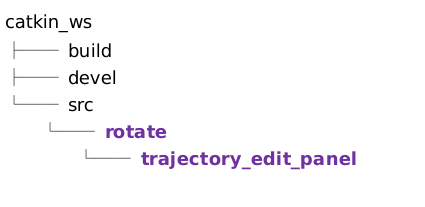
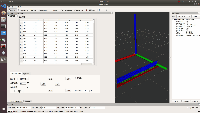

# rotate
说明：制作一个可视化工具，对轨迹点的旋转，进行编辑。

# 依赖：
ros-melodic(18.04) Rviz QtMedia Eigen Qt5.12

# 目录结构

# 操作：
1）将ros包放入工作空间，目录结构如上
###
2）输入命令: catkin_make
###
3）输入命令: roslaunch trajectory_edit_panel execute.launch
###
